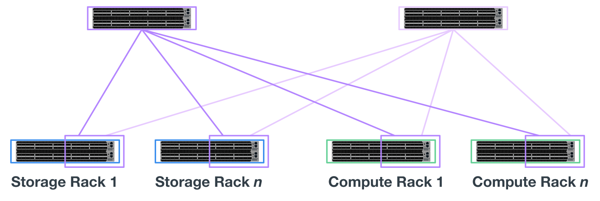

= 아키텍처 개요
:hardbreaks:
:allow-uri-read: 
:nofooter: 
:icons: font
:linkattrs: 
:imagesdir: ./media/

[role="lead"]
BeeGFS on NetApp 솔루션에는 검증된 워크로드를 지원하는 데 필요한 특정 장비, 케이블링, 구성을 결정하는 데 사용되는 아키텍처 설계 고려사항이 포함되어 있습니다.

== 빌딩 블록 아키텍처

스토리지 요구 사항에 따라 BeeGFS 파일 시스템을 다양한 방식으로 구축 및 확장할 수 있습니다. 예를 들어, 주로 작은 파일을 많이 사용하는 사용 사례에서는 메타데이터 성능과 용량이 더 큰 반면, 큰 파일이 적은 사용 사례에서는 실제 파일 콘텐츠에 대해 더 많은 스토리지 용량과 성능을 선호할 수 있습니다. 이러한 여러 가지 고려 사항은 병렬 파일 시스템 구축의 여러 가지 차원을 영향을 주므로 파일 시스템을 설계하고 구축하는 작업이 더 복잡해집니다.

이러한 문제를 해결하기 위해 NetApp은 이러한 각 차원을 확장하는 데 사용되는 표준 구성 요소 아키텍처를 설계했습니다. 일반적으로 BeeGFS 빌딩 블록은 다음 세 가지 구성 프로파일 중 하나로 구축됩니다.

* BeeGFS 관리, 메타데이터 및 스토리지 서비스를 포함한 단일 기본 구성 요소입니다
* BeeGFS 메타데이터 및 스토리지 구성 요소입니다
* BeeGFS 스토리지 전용 구성 요소입니다

이 세 가지 옵션 간의 하드웨어 변경 사항은 BeeGFS 메타데이터에 더 작은 드라이브를 사용하는 것입니다. 그렇지 않으면 모든 구성 변경 사항이 소프트웨어를 통해 적용됩니다. 또한 Ansible을 구축 엔진으로 사용하면 특정 구성 요소에 대해 원하는 프로필을 설정하여 구성 작업을 간단하게 수행할 수 있습니다.

자세한 내용은 을 참조하십시오 <<Verified hardware design>>.

== 파일 시스템 서비스

BeeGFS 파일 시스템에는 다음과 같은 주요 서비스가 포함됩니다.

* 관리 서비스.* 다른 모든 서비스를 등록하고 모니터링합니다.
* * 스토리지 서비스. * 데이터 청크 파일이라고 하는 분산 사용자 파일 콘텐츠를 저장합니다.
* * 메타데이터 서비스. * 파일 시스템 레이아웃, 디렉토리, 파일 특성 등을 추적합니다.
* * 클라이언트 서비스. * 파일 시스템을 마운트하여 저장된 데이터에 액세스합니다.

다음 그림에서는 NetApp E-Series 시스템에 사용된 BeeGFS 솔루션 구성 요소 및 관계를 보여 줍니다.

image:../media/beegfs-components.png[""]

BeeGFS는 병렬 파일 시스템으로서 여러 서버 노드에서 파일을 스트라이핑하여 읽기/쓰기 성능과 확장성을 극대화합니다. 서버 노드는 함께 작동하여 일반적으로 _clients_라고 하는 다른 서버 노드에서 동시에 마운트하고 액세스할 수 있는 단일 파일 시스템을 제공합니다. 이러한 클라이언트는 NTFS, XFS 또는 ext4와 같은 로컬 파일 시스템과 유사하게 분산 파일 시스템을 보고 사용할 수 있습니다.

지원되는 다양한 Linux 배포판에서 4개의 기본 서비스를 실행하고 InfiniBand(IB), OPA(Omni-Path), RoCE(RDMA over Converged Ethernet)를 비롯한 TCP/IP 또는 RDMA 지원 네트워크를 통해 통신합니다. BeeGFS 서버 서비스(관리, 스토리지 및 메타데이터)는 사용자 공간 데몬이며, 클라이언트는 네이티브 커널 모듈(패치리스)입니다. 모든 구성요소를 재부팅하지 않고 설치 또는 업데이트할 수 있으며 동일한 노드에서 서비스 조합을 실행할 수 있습니다.

== 검증된 노드

NetApp 기반 BeeGFS 솔루션에는 NetApp EF600 스토리지 시스템(블록 노드) 및 Lenovo ThinkSystem SR665 서버(파일 노드)의 검증된 노드가 포함됩니다.

=== 블록 노드: EF600 스토리지 시스템

NetApp EF600 All-Flash 어레이는 일관된 거의 실시간에 가까운 데이터 액세스를 제공하는 동시에 모든 워크로드를 동시에 지원합니다. AI 및 HPC 애플리케이션에 데이터를 지속적으로 신속하게 제공하기 위해 EF600 스토리지 시스템은 하나의 엔클로저에 최대 2백만 개의 캐시된 읽기 IOPS, 100마이크로초 미만의 응답 시간, 42GBps 순차적 읽기 대역폭을 제공합니다.

=== 파일 노드: Lenovo ThinkSystem SR665 서버

SR665는 PCIe 4.0을 지원하는 2소켓 2U 서버입니다. 이 솔루션의 요구사항을 충족하도록 구성하면 직접 연결된 E-Series 노드에서 제공하는 처리량 및 IOP와 잘 어울리도록 구성에서 BeeGFS 파일 서비스를 실행할 수 있는 충분한 성능을 제공합니다.

Lenovo SR665에 대한 자세한 내용은 를 참조하십시오 https://lenovopress.com/lp1269-thinksystem-sr665-server["Lenovo 웹 사이트"^].

== 검증된 하드웨어 설계

다음 그림에 나와 있는 솔루션의 구성 요소는 BeeGFS 파일 계층에 2개의 듀얼 소켓 PCIe 4.0 지원 서버를 사용하고 블록 계층으로 2개의 EF600 스토리지 시스템을 사용합니다.

image:../media/beegfs-design-image2-small.png[""]

NOTE: 각 구성 요소에 BeeGFS 파일 노드가 2개 포함되어 있으므로 페일오버 클러스터에 쿼럼을 설정하려면 최소 2개의 구성 요소가 필요합니다. 2노드 클러스터를 구성할 수 있지만 이 구성에는 페일오버가 발생하지 않도록 할 수 있는 제한이 있습니다. 2노드 클러스터가 필요한 경우 세 번째 장치를 Tiebreaker로 통합할 수 있습니다(단, 이 설계에서는 다루지 않음).

각 구성 요소는 파일 및 블록 계층에 대한 장애 도메인을 분리하는 2계층 하드웨어 설계를 통해 고가용성을 제공합니다. 각 계층은 독립적으로 페일오버될 수 있으므로 복원력을 높이고 계단식 고장 위험을 줄일 수 있습니다. HDR InfiniBand를 NVMeOF와 함께 사용하면 전체 이중화 및 충분한 링크 초과 할당으로 파일 노드와 블록 노드 간에 높은 처리량과 최소 지연 시간을 제공하여 시스템이 부분적으로 성능 저하 상태일 때도 분리되는 설계를 병목 현상이 발생하지 않습니다.

BeeGFS on NetApp 솔루션은 구축 환경의 모든 구성 요소에서 실행됩니다. 구축된 첫 번째 구성 요소는 BeeGFS 관리, 메타데이터 및 스토리지 서비스(기본 구성 요소라고도 함)를 실행해야 합니다. 이후의 모든 구성 요소는 소프트웨어를 통해 BeeGFS 메타데이터 및 스토리지 서비스를 실행하거나 스토리지 서비스만 실행하도록 구성됩니다. 각 구성 요소에 서로 다른 구성 프로필을 사용할 수 있으므로 동일한 기본 하드웨어 플랫폼 및 구성 요소 설계를 사용하여 파일 시스템 메타데이터 또는 스토리지 용량과 성능을 확장할 수 있습니다.

최대 5개의 빌딩 블록이 독립 실행형 Linux HA 클러스터에 결합되어 클러스터 리소스 관리자(페이스 메이커)당 적절한 리소스 수를 확보하고 클러스터 구성원을 동기화 상태로 유지하는 데 필요한 메시징 오버헤드를 줄입니다(Corosync). 충분한 구성원이 쿼럼을 설정할 수 있도록 클러스터당 최소 2개의 빌딩 블록을 사용하는 것이 좋습니다. 이러한 독립 실행형 BeeGFS HA 클러스터 중 하나 이상이 결합되어 클라이언트가 단일 스토리지 네임스페이스로 액세스할 수 있는 BeeGFS 파일 시스템(다음 그림에 표시)을 생성합니다.

image:../media/beegfs-design-image3.png[""]

궁극적으로 랙당 구성 요소의 수는 해당 사이트의 전력 및 냉각 요구 사항에 따라 달라지지만, 이 솔루션은 스토리지/데이터 네트워크에 사용되는 2개의 1U InfiniBand 스위치를 위한 공간을 제공하면서 단일 42U 랙에 최대 5개의 구성 요소를 구축할 수 있도록 설계되었습니다. 각 구성 요소마다 8개의 IB 포트(이중화를 위해 스위치당 4개)가 필요하므로, 5개의 구성 요소는 40포트 HDR InfiniBand 스위치(예: NVIDIA QM8700)에 포트의 절반을 남겨 FAT 트리 또는 이와 유사한 비차단 토폴로지를 구현할 수 있습니다. 이렇게 구성하면 네트워킹 병목 현상 없이 스토리지 또는 컴퓨팅/GPU 랙 수를 확장할 수 있습니다. 필요에 따라 스토리지 패브릭 공급업체의 권장 사항에서 초과 할당된 스토리지 패브릭을 사용할 수 있습니다.

다음 이미지는 80노드 FAT 트리 토폴로지를 보여줍니다.

Ansible을 NetApp 기반의 BeeGFS 구축을 위한 배포 엔진으로 사용하여 관리자는 최신 인프라를 코드 사례로 사용하여 전체 환경을 유지할 수 있습니다. 이렇게 하면 복잡한 시스템이 될 수 있는 일이 크게 단순화되어 관리자가 한 곳에서 구성을 정의 및 조정한 다음, 환경 확장규모에 관계없이 일관되게 적용할 수 있습니다. BeeGFS 컬렉션은 에서 구할 수 있습니다 https://galaxy.ansible.com/netapp_eseries/beegfs["Ansible 갤럭시"^] 및 https://github.com/netappeseries/beegfs/["NetApp의 E-Series GitHub를 참조하십시오"^].
