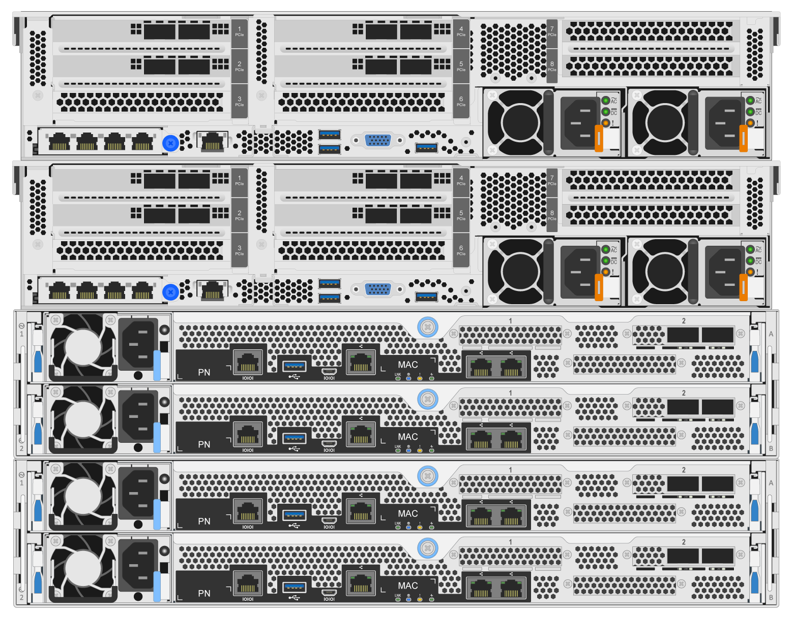
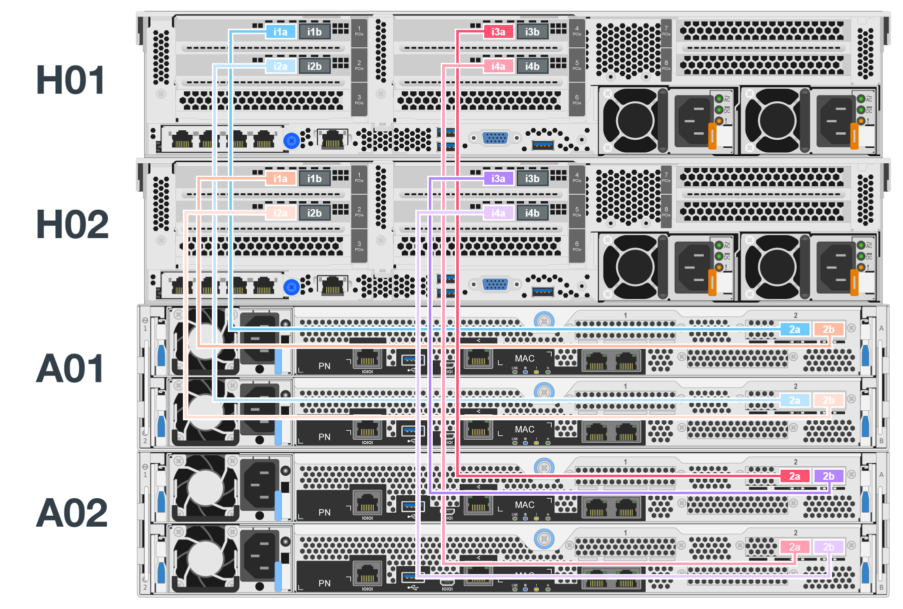

= 하드웨어 구축
:hardbreaks:
:allow-uri-read: 
:nofooter: 
:icons: font
:linkattrs: 
:imagesdir: ./media/

[role="lead"]
각 구성 요소는 HDR(200GB) InfiniBand 케이블을 사용하여 두 블록 노드에 직접 연결된 검증된 x86 파일 노드 2개로 구성됩니다.

NOTE: 장애 조치 클러스터에서 쿼럼을 설정하려면 최소 2개의 구성 요소가 필요합니다. 2노드 클러스터에는 성공적인 페일오버를 수행할 수 없는 제한 사항이 있습니다. 세 번째 장치를 Tiebreaker로 통합하여 2노드 클러스터를 구성할 수 있지만, 이 문서에서는 그러한 설계에 대해 설명하지 않습니다.

BeeGFS 메타데이터와 스토리지 서비스를 모두 실행하는 데 사용되는지 아니면 스토리지 서비스만 실행하는 데 사용되는지에 관계없이 클러스터의 각 구성 요소에 대해 다음 단계는 동일합니다.

.단계
. 에 지정된 모델을 사용하여 4개의 HCA(호스트 채널 어댑터)로 각 BeeGFS 파일 노드를 link:beegfs-technology-requirements.html["기술 요구사항"]설정합니다. 아래 사양에 따라 파일 노드의 PCIe 슬롯에 HCA를 삽입합니다.
+
** * Lenovo ThinkSystem SR665 V3 서버: * PCIe 슬롯 1, 2, 4 및 5를 사용합니다.
** * Lenovo ThinkSystem SR665 서버: * PCIe 슬롯 2, 3, 5 및 6을 사용합니다.

. 이중 포트 200GB 호스트 인터페이스 카드(HIC)로 각 BeeGFS 블록 노드를 구성하고 두 스토리지 컨트롤러 각각에 HIC를 설치합니다.
+
두 개의 BeeGFS 파일 노드가 BeeGFS 블록 노드 위에 있도록 구성 요소를 랙에 설치하십시오. 다음 그림은 Lenovo ThinkSystem SR665 V3 서버를 파일 노드로 사용하는 BeeGFS 구성 요소의 올바른 하드웨어 구성을 보여줍니다(후면).

+

+

NOTE: 운영 활용 사례에 대한 전원 공급 장치 구성은 일반적으로 중복 PSU를 사용해야 합니다.

. 필요한 경우 각 BeeGFS 블록 노드에 드라이브를 설치합니다.
+
.. 빌딩 블록을 사용하여 BeeGFS 메타데이터 및 스토리지 서비스를 실행하고 작은 드라이브를 메타데이터 볼륨에 사용하는 경우 아래 그림과 같이 가장 바깥쪽 드라이브 슬롯에 채워졌는지 확인합니다.
.. 모든 구성 요소 구성에서 드라이브 엔클로저가 완전히 채워지지 않은 경우 최적의 성능을 위해 슬롯 0–11 및 12–23에 동일한 수의 드라이브가 채워졌는지 확인하십시오.
+
image:../media/driveslots.png[""]

. 다음 그림에 표시된 토폴로지와 일치하도록 를 사용하여 블록 및 파일 노드를 link:beegfs-technology-requirements.html#block-file-cables["1m InfiniBand HDR 200GB 직접 연결 구리 케이블"]연결합니다.
+

+

NOTE: 여러 빌딩 블록의 노드는 직접 연결되지 않습니다. 각 구성 요소는 독립형 장치로 취급해야 하며 구성 요소 간의 모든 통신은 네트워크 스위치를 통해 이루어집니다.

. InfiniBand 스토리지 스위치에 해당하는 를 사용하여 파일 노드의 나머지 InfiniBand 포트를 스토리지 네트워크의 InfiniBand 스위치에 link:beegfs-technology-requirements.html#file-switch-cables["2M InfiniBand 케이블"] 연결합니다.
+
Splitter 케이블을 사용하여 스토리지 스위치를 파일 노드에 연결하는 경우 케이블 하나가 스위치에서 분기되어 밝은 녹색으로 표시된 포트에 연결되어야 합니다. 다른 스플리터 케이블이 스위치에서 나와서 어두운 녹색으로 표시된 포트에 연결해야 합니다.

+
또한 중복 스위치가 있는 스토리지 네트워크의 경우 연한 녹색으로 표시된 포트가 하나의 스위치에 연결되고 진한 녹색의 포트는 다른 스위치에 연결해야 합니다.

+
image:../media/networkcable.png[""]

. 필요한 경우 동일한 케이블 연결 지침에 따라 추가 구성 요소를 조립합니다.
+

NOTE: 단일 랙에 구축할 수 있는 총 구성 요소 수는 각 사이트의 사용 가능한 전력 및 냉각에 따라 다릅니다.

