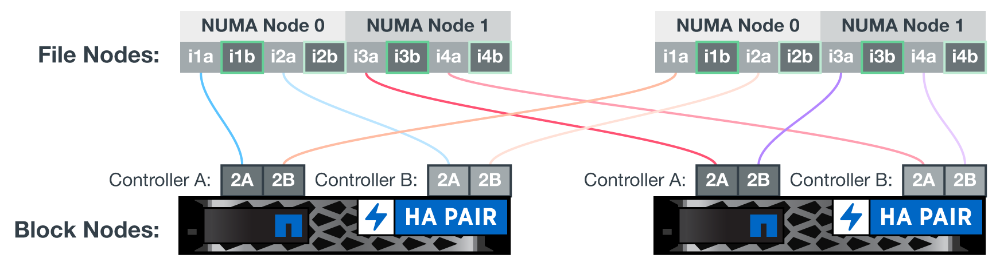

= 하드웨어 구성
:hardbreaks:
:allow-uri-read: 
:nofooter: 
:icons: font
:linkattrs: 
:imagesdir: ./media/

[role="lead"]
NetApp의 BeeGFS에 대한 하드웨어 구성에는 파일 노드 및 네트워크 케이블 연결이 포함됩니다.

== 파일 노드 구성

파일 노드에는 동일한 수의 PCIe 슬롯 및 메모리에 대한 로컬 액세스를 포함하는 별도의 NUMA 존으로 구성된 2개의 CPU 소켓이 있습니다.

InfiniBand 어댑터는 적절한 PCI 라이저 또는 슬롯에 설치되어야 사용 가능한 PCIe 레인 및 메모리 채널에 걸쳐 작업 부하가 분산됩니다. 개별 BeeGFS 서비스에 대한 작업을 특정 NUMA 노드에 완전히 격리하여 워크로드의 균형을 조정합니다. 목표는 두 개의 독립적인 단일 소켓 서버처럼 각 파일 노드에서 유사한 성능을 얻는 것입니다.

다음 그림에서는 파일 노드 NUMA 구성을 보여 줍니다.

image:../media/beegfs-design-image5-small.png[""]

BeeGFS 프로세스는 사용된 인터페이스가 동일한 존에 있도록 특정 NUMA 존에 고정됩니다. 이렇게 구성하면 소켓 간 연결을 통한 원격 액세스가 필요하지 않습니다. 소켓 간 연결은 QPI 또는 GMI2 링크라고도 합니다. 최신 프로세서 아키텍처에서도 HDR InfiniBand와 같은 고속 네트워킹을 사용할 때 병목 현상이 발생할 수 있습니다.

== 네트워크 케이블 연결 구성

구성 요소 내에서 각 파일 노드는 총 4개의 중복 InfiniBand 연결을 사용하여 2개의 블록 노드에 연결됩니다. 또한 각 파일 노드에는 InfiniBand 스토리지 네트워크에 대한 4개의 이중화된 접속이 있습니다.

다음 그림에서 주목하십시오.

* 녹색으로 표시된 모든 파일 노드 포트는 스토리지 패브릭에 접속하는 데 사용되며, 다른 모든 파일 노드 포트는 블록 노드에 직접 연결됩니다.
* 특정 NUMA 존에 있는 2개의 InfiniBand 포트는 동일한 블록 노드의 A 및 B 컨트롤러에 연결됩니다.
* NUMA 노드 0의 포트는 항상 첫 번째 블록 노드에 연결됩니다.
* NUMA 노드 1의 포트는 두 번째 블록 노드에 연결됩니다.

NOTE: 이중화 스위치가 있는 스토리지 네트워크의 경우 녹색으로 표시된 포트가 한 스위치에 연결되고 어두운 녹색으로 표시된 포트는 다른 스위치에 연결해야 합니다.

그림에 표시된 케이블 연결 구성을 통해 각 BeeGFS 서비스는 다음을 수행할 수 있습니다.

* BeeGFS 서비스를 실행 중인 파일 노드에 관계없이 동일한 NUMA 존에서 실행합니다.
* 장애 발생 위치에 관계없이 프런트엔드 스토리지 네트워크와 백엔드 블록 노드에 대한 보조 최적 경로 제공
* 블록 노드의 파일 노드 또는 컨트롤러에 유지 관리가 필요한 경우 성능 영향을 최소화합니다.

PCIe 양방향 대역폭을 최대한 활용하려면 각 InfiniBand 어댑터의 포트 하나를 스토리지 패브릭에 연결하고 다른 포트는 블록 노드에 연결해야 합니다. HDR InfiniBand 포트의 이론적인 최대 속도는 25GBps입니다(신호 및 기타 오버헤드는 고려하지 않음). PCIe 4.0 x16 슬롯의 최대 단일 방향 대역폭은 32GBps이며 이론적으로 50GBps 대역폭을 처리할 수 있는 이중 포트 InfiniBand 어댑터가 통합된 파일 노드를 구현할 때 잠재적인 병목 현상이 발생합니다.

다음 그림은 전체 PCIe 양방향 대역폭을 활용하는 데 사용되는 케이블링 설계를 보여줍니다.

image:../media/beegfs-design-image7.png[""]

각 BeeGFS 서비스에 대해 동일한 어댑터를 사용하여 클라이언트 트래픽에 사용되는 기본 포트를 해당 서비스 볼륨의 기본 소유자인 블록 노드 컨트롤러의 경로와 연결합니다. 자세한 내용은 을 참조하십시오 link:beegfs-design-software-architecture.html["소프트웨어 구성"].
